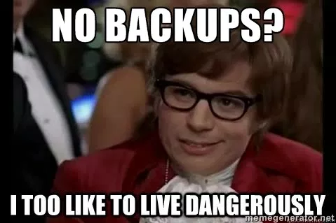
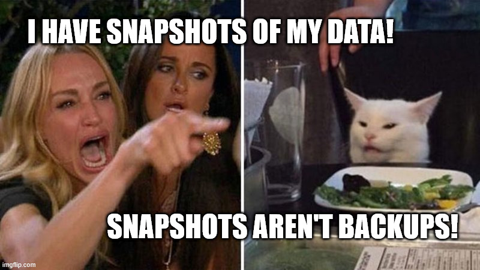
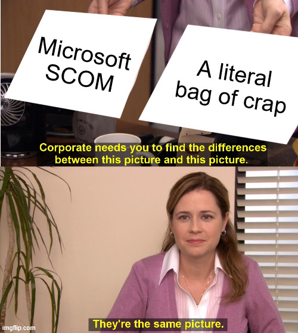
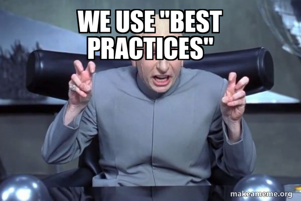
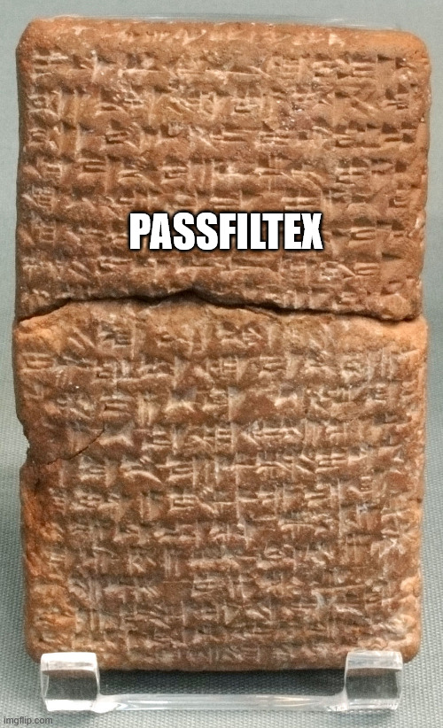
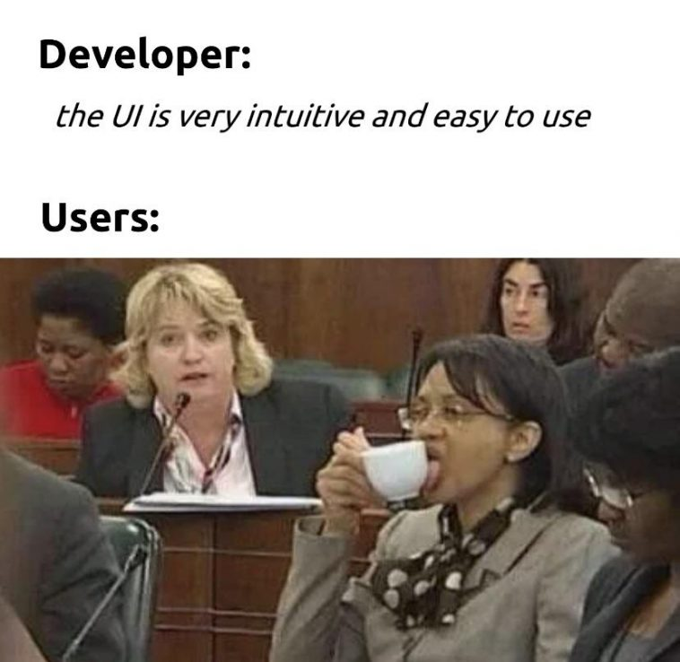

# Introduction
I've been to a few cons, watched countless cons online, and been through more AD Security training than I care to imagine. I've seen talks similar to what I'm going to give but they tend to focus on "big projects", and they come from the consultant/pentester perspective. I'm neither of those. While I am not advertising here where I work, It's not a secret. I am in the trenches. This talk is not going to be a glorified pick list you could find from an auditor's report. I'll tell you how to get one of those as one of my slides, but I'm not just repeating the same suggestions. 

My goal is to give you some meaningful items you could deploy on a budget that will move that security bar forward and keep the auditors and pentesters off your back, while also helping you sleep better at night, hopefully. 

## About Me
So I'm Tyler. Otherwise, known as Poolmanjim in most online circles where you find me. I have a blog that I suck at writing and a github called ActiveDirectoryKC. 

I've been doing IT since I got out of high school and been Windows-focused the hold time with the last 10 or so years being focused 100% on identity. I'm still very much an on-prem guy who is embracing the cloud where it makes sense and I'm still very skeptical and dubious of AI. Currently I work for a large healthcare organization on the West Coast, remotely -- I live in the KC area. Most of my experience has been within the healthcare industry so please don't tell me how to get off NTLM in a year, because I'm not gullible. 

Other than that, I've been the lead moderator of Reddit r/ActiveDirectory for many years answering questions and being helpful. In the past 2-3 years I've really been focused on making sure we have a good list of resources for the community so I encourage you to check the r/ActiveDirectory wiki or my Github for literally hundreds of links to AD tools. 

I have ADHD so that makes things fun sometimes and I got a C in Public Speaking so you're all in for a ride. 

## Want to Know More?
Who are my homelabbers in the room? 
Good news, everything in this talk is homelab friendly -- at least in the sense that it is deployable in homelab. There are only a couple of paid things I'll mention, and there are alternatives. 

I'll have all the slides available at worst by EOB today on my Github. I have two QR codes at the end, one for my LinkedIn and one for my Github. I also provide the links for the QR code squeamish. I encourage you to download the slides. I have a limited presentation time here and probably have 3x what you'll see in slides and notes. 

## Disclaimer
Before I go too far I want to make a couple of things clear. 
1. Some of these tools are tools that will provoke your SIEM/ITDR solutions. Make sure you work with your Cybersecurity teams before you go too far. You don't want to end up on a list that you don't already intend to be on.
2. I am going to talk about products from various, at times competing, 3rd parties. I don't work for any of these (currently) and even if I did, I don't care. I don't care about the corporate noise -- I just want to help improve your Identity systems. 
3. Some of the products I'll talk about require email submission and others are trials. I have a rule about recommending something if it is a trial product what does the after-the-trial product do? Is it useful? If it is I'll talk about it. Anything I talk about is the post-trial/free/etc. version unless I specifically say otherwise. 

# BCDR / Business Resilience

 > Miser Says - Backups cost money and don't do anything. 
 
Executives seem to glaze over when I bring up BCDR. I can understand why. BCDR isn't a new shiny dashboard with a big red wheel of "vulnerabilities" on it. It is boring, you either have them or you don't and few of us have the cycles to actually make sure they don't suck. 

Here is the one area I'm going to say that you should break the Miser theme and straight up by a good BCDR solution for your directory. I'm not going to say from whom because I don't care at this point. Find me later if you want a real opinion. 

Yes it will be expensive. Here's the thing. When your butt is out in the wind and you need to restore your identity -- because without it everything is down -- you don't want to be alone. You want that sweet sweet support contract with a vendor to get you some help. 

If you're going to spend money, buy BCDR before you buy another PAM solution or another SIEM solution or another vulnerability management solution. BCDR first. Please. Too many places are being owned without good backup plans. Don't be part of that statistic without putting up a fight. 

### Miser's Guide to Active Directory BCDR

I get it this is a talk about saving money. So what do you do if you can't buy a pro tool for BCDR? 

The most important place to start with with BCDR is goals. You need to figure out your recovery goals. This should be defined by leadership, but often it isn't. When it comes to restoring Active Directory, or Identity in general, you're in the top three things that need to be online: Network First, Compute Second, then Identity. 

What are you trying to protect against? Sure, servers can get corrupted or you could have accidental deletions. But is that all you're protecting against? What about full outage, like everything gone? What if everything is cryptoed? 

With those things in mind, here are my BCDR must haves.
1. Must be able to recover my forest/domain.
2. Must be able to support the 3-2-1 + 1 rule. 
3. Must be able to be meaningfully airgapped/write protected. 
4. Must support Active Directory. 

With those things in mind. I need to say something... SNAPSHOTS ARE NOT BACKUPS!
VM Snapshots are not backups. They aren't. They are often part of a recovery solution, but they are not a recovery solution, despite what the vendor says. 

First of all, AD doesn't like snapshots that much. There are issues there, have been for a long time. 
Secondly, that is putting your fabric/hypervisor administrators in the role of backup administrators and in a world of Zero Trust, I don't trust them! If you have separate roles for those teams. 
Thirdly, A snapshot is a capture of the configuration items. Snapshots are maybe file aware, but they aren't AD-aware so you will capture more than you need. When AD is compromised, they tend to embed into the OS so you stand a good chance of backing up the thing that compromised you and restoring it. 

## My Recommendations
First on the list is honestly just use Windows Server Backup (WSB) if you're on-prem physical or running on Hyper-V or VMWare or whatever. It's not the best tool and lord knows it is very, very clunky, but it does work and you can restore from it. Oh, and Microsoft supports it so you can call them and they have notes on how to restore from it.

Second part, you can get an off-the-shelf NAS that gives you storage options on the network. I recommend researching if they support WORM (Write-Once-Read-Many) storage options as that is critical to protecting your backups from being encrypted or misused. To this end, you could even spin up a TrueNAS build as they have built-in WORM with their free version. 

Third, control access to those backups. Make sure that only the teams that need access have access and everyone else is left out. Also, consider keeping those backup systems offline and off domain whenever possible. You want as little access to those systems as possible. 

Ideal world: Ideally your backup store system would be super isolated.  If I have my way that would be as few enterprise tools as possible because each one of those exploitable. 

An alternative solution to this would be to use any of the Azure-based backup solutions for systems. They does add some cost but they do work. My only issue is they are a little black-box and if you're Azure isn't properly secured, there could be a lot of access to those backups. 

## My Solution
I have been developing a solution to help with some of this for a long time. It is basically a bunch of PowerShell around Windows Server Backup and an off-domain file server. I encourage you to look at it as it takes a lot of this into consideration.

The big thing that I want to point out with it is that it supports SMB Encryption and Signing and it uses Kerberos authentication to pull the backups from the domain controller. The archive server is not on the domain but uses a limited account to simply pull the backup information from the domain controller ensuring the domain controller does not have access to your backup solution. 

I encourage you to take a look at that if you want to see my workflow and use some of my process. 

> NOTE: Do we need an IFM + DSI note here?

# Monitoring, Auditing, and Alerting
Here's the part where I start dumping tools on everyone and reminding you I don't work for anyone and even if that changes or I did, I'm going to recommend the best. My integrity means more to me than pushing something stupid. 

## Problem with Tools
If you've had experiences like mine, you've ended up in several situations where your company buys a tool, uses 10% of it, and never expands the deployment. I say that to say there is a good chance there is a tool that can do what you're trying to do already. So look at what your organization has. Always question what permissions something has to Domain controllers, Active Directory, and your high-level (Domain/Enterprise) admins. 

The next thing to mention is that there are dozens of cybersecurity tools out there. Leaders like to chase big shiny projects and they like being wined and dined by vendors. Often most of us don't have the time to be experts in the fields these tools claim to be experts in, so we have to trust them. When that happens we end up getting sold the Nile, the Pyramids, and the Spynx's nose. Rather than chasing shiny, I encourage chasing effectiveness and value.

Finally, tool access. Vulnerability scanners are an example here. "To tell you how secure your AD is, we need to scan it and to do that we need an account with domain admin". You may laugh at me, but if something needs a SYSTEM service account or "local administrator" on a Domain Controller, it has Domain Admin rights effectively. Ask questions! Fight permission over use! Cyber teams, your tools are cool and great but ask the question: What if my tool is the tool that gets compromised? I'll cover some of this more in the hardening section.

## Monitoring AD

If someone were to ask me whether I would have a killer vulnerability scanning tool or a monitoring tool for AD, I'd answer monitoring. I don't mean security monitoring either. I mean simple system performance monitoring. 

Why? 

Because Operational Risk is still risk! If the disks are failing on my DCs that could be just as impactful as a malware on the business! Odds are, in many orgs, you've bought *some* security tools, but monitoring may not be getting as much love. Always remember at the end of the day our jobs as IT Admins and even as security admins is to provide business value. God I sound like an exec when I say that and hate myself a little.

Nonetheless, it is true. If the system just doesn't work, it is no better than if it is compromised. And if you're thinking compliance, most critical infrastructure and the like (healthcare) have fines associated with unavailability. I am not a healthcare risk expert and I definitely cannot say that when networks in healthcare are impacted that patient care and success rates are impacted negatively. I totally cannot say that. 

### Performance Monitoring

When it comes to simple performance monitoring the easy answer for a lot of places is SCOM, Systems Center Operations Manager. If you have a System Center license, you have it even if it isn't deployed. This tool can monitor AD. I also hate everything about SCOM. 

Another product that I recommend is Zabbix. It is a free tool with paid support that can extend it quite a bit. There are also tons and tons of tutorials and resources out there. The gotcha with Zabbix is that it is very Linux centric and most of the public AD resources are out-of-date or insufficient. I took it upon myself to develop templates for Zabbix around my wants and needs in AD. It is far from perfect, but trust me it is better than what I've seen.

One big concern with Zabbix is that it uses a SYSTEM-level agent and can execute arbitrary code. Personally, I don't do Zabbix scripts on AD and ideally you'd have a dedicated AD instance. That may not be super easy, so just don't allow the local agents to execute scripts. 

There are other products, and I'm sure many of you would say "use mysupercoolpublictool for monitoring, it is so much better than zabbix". You may be right. This is what I've used, liked, and endorse. 

Now if you're willing to do some spending, look into Azure Log Analytics and Azure Monitor for doing this. There are even some publicly available workbooks that really do a phenomenal job of creating reporting dashboards for system health. 

### Change Monitoring
Did you expect to see this? I bet not. 

Change Montioring is not Change Management. I don't care if you log a CR for something. Change Monitoring is monitoring the daily work in AD. Users are created, passwords reset, computers moved, GPOs linked, etc. How do we keep track of all of that? 

Firstly, make sure you set your audit policies. I tend to base off of CIS or DISA (more coming on those). These are essential as they generate the event IDs you need to track activity. Microsoft even published a list of events related to "signs of compromise" which covers lots of legitimate use but would also capture malicious use. 

Next, we need a way to aggregate all of this. Simple event log monitoring is okay, but AD doesn't provide all the details in event logs. Most vendors cover this solution with agents, but there has been a recent trend to move away from monitoring agents for changes and use the in-built replication API. 

#### Recommendations
- Configure Active Directory Advanced Audit Policies per CIS Benchmarks/DISA STIGS/Microsoft baselines.
- Download and install Cayosoft Guardian Protector in your environment. 
	- I'll be the first to say Cayosoft isn't my favorite vendor, but I'd be lying if this tool wasn't something misisng in the market. 
	- The free version is very limited and only keeps track of a few days of changes, but it is way, way better than nothing. 
	- This will harvest contact information, but that can be gotten by with fake emails and what not. Just make sure they are not "gmail.com" emails. 

## BONUS: Vulnerability Monitoring / SIEM and Log Monitoring
I lumped a few things together here. 

# Baselines, STIGs and Benchmarks
> Make sure and include a presentation slide. for the SCAP vs Baseline scan. 
> 
> How to make CIS and Hardening Kitty fit well. 
> 
> Adjust recommendations and contradictions. 

> Scrooge Says: I'm not hiring any more people. Figure out how to make us secure with what you have. 

Okay quick show of hands. 
- Who here has been asked to implement something using "Best Practices"?
- Who here actually was able to implement the best practices? 
- Who here actually knew the best practices without looking it up first? 

Yeah. I've built literally hundreds of domains and several thousand DCs at this point and I cannot tell you all the best practices off the top of my head 

How do we find these mythical baselines? Well lucky for you there are options. 

The three "baselines" I go for are Microsoft Security Baselines, DISA STIGs, and CIS Benchmarks. This is really one of those "choose your own adventure" concepts for most organizations. 

### MS Security Baselines
I recommend for most places, start with the Microsoft Baselines. It's a free download and a little clunky to use, but it will help you get a good start. With the download you'll get "drop in" GPO templates and there are a couple of tools: Policy Analyzer, which can compare what you have currently versus the baseline; and LGPO which can be used to audit and edit local group policy. 

There is one other thing that these include that has been a game changer for me so far. The download includes a download of a collection of excel spreadsheets that include the mappings for most Group Policy settings to their corresponding Registry Keys. This applies to most policies, but not any of the "Security Options" since those aren't registry settings. This spreadsheet is a really good resource. I even I have it pinned in excel and use it often. 

The downsides to MS Security Baselines are they are Windows-only, but you're in an Active Directory hardening talk. If you were expecting Linux hardening tips see me after and tell you to ask someone else. The other disadvantage is they are somewhat limited. If you compare them to the other two I'm going to talk about, they are not as comprehensive. But remember "Perfect is the enemy of good". 

### DISA STIGs
I could ask anyone who's used these raise their hands but this is not a game of Spot the Fed. 

DISA STIGs are a type of baselining/benchmarking that is put out by the US Government for the US Government. I know that inspires tons of confidence, but give them a chance here. 

DISA has STIGs for lots of systems and Microsoft products are just some of them. There are STIGs for Linux, Cisco, and so on. They even have non-GPO STIGs for Microsoft, like Ansible-based Microsoft STIGs. 

STIGs tend to be more comprehensive than the Microsoft Baselines, which is always good. But my favorite thing about STIGs is the SCAP tool. This is a free download and it will do local or remote scanning of systems based on the specified STIG benchmark you included with the scan. The usual scan permissions apply, but it really can get you a good picture of the compliance. 

The big downside of STIGs is that they are very, very, very much focused on the US Government, specifically the Department of Defense. If you look there are settings that really only apply to the US Government. The two I always remember are the requirement to use US Government Root CAs and to use US Government Time Servers. You can obviously ignore those specific findings and use that more as a reminder or a template for making sure you have your own secured Root CA and a known good time source. 

You're all doing those things right?

There are lots of little nuggets of good information in the DISA STIGs and there are several online resources for searching them and getting the information. They're probably my favorite long term option for best practices as the SCAP tool is super useful. 

ADHD tangent: The format for the SCAP tool scans is kind of wierd. I looked at it a long time ago and decided it wasn't worth my time. I have it on good authority that you can use your LLM of choice to make your own SCAP Benchmarks and rip out the government-specific things in favor of your own. 

(Ding: AI mention)

> EXCLUDED - Drop-in-GPOs

### CIS Benchmarks
CIS Benchmarks compare a lot to DISA STIGs. The big difference are CIS Benchmarks can go down some rabbit holes and can be super comprehensive. They are, admittedly, the ones I'm least familiar with. 

They're not bad and they are more generic than DISA STIGS so there aren't any "US Government" items in them, and they offer solid guidelines for the items instead. My biggest dislike of CIS Benchmarks are that they 1) require an email to download the PDF guides and 2) they require you to pay for their scanning tool. Compliance checks depend on either their paid tool or third parties. 

CIS will show up in pretty much any non-US Government compliance lists. 

### Making Sense Of It All
If you don't know where to start, start with MS Baselines. They're fast, their simple. 

Regardless of where you start, review the settings and get a rough idea of compliance. If you're looking at STIGs or CIS Benchmarks they're categorized by severity. I recommend reviewing the missing configurations or items and splitting them into three groups: high-impact, moderate-impact, and low-impact. Impact here isn't security risk -- impact is how likely am I to cause an a resume generating event by doing this? I have a list in the slide notes that you can look at later where I make an attempt to do some of this categorization for you, so I encourage you to look at that. Just be careful, what I think is low impact may not be low impact in your environment.

Get projects started and approvals moving for the bigger items and start knocking out the low-impact items. They will move your bar forward and while the gains won't be great, they are a start. Once those start moving you can start focusing on the larger items. 

Another thing I tend to do is compare the settings from a couple of the different benchmarks and choose the stricter of the two when they differ. This is particularly useful for audit settings as they vary a lot between the different baselines. 

Don't get overwhelmed. From there work through the findings systematically. Anything you can implement easily without taking on too much business risk, do it. Everything else get plans and projects in place to start resolving them over time. If your security team is pushing for things, that helps prioritize. 

### BONUS: Hardening Kitty
> NEED IT

### BONUS: STIGS and Baselines Impact Analysis
> NEED IT

# Password Controls

> Scrooge Says: Long passwords cause lockouts and lockouts lose money. 

Scrooge actually may be right there, but he's also wrong. NIST recently completely overhauled their recommendations for passwords and their new recommendations take into account a lot of things that the security industry has been saying for years. 

Longer passwords = harder to crack.
Complex passwords = Hard to remember
Forced password resets = Causes help desk incidents
Pass-Keys = Good.
MFA = Good. 
Bad Password Lists = Great. 

The problem with their recommends are two fold. First, most standards and auditing bodies haven't fully caught on and have outdated recommendations. The second is that some of these items are easier said than done, especially in smaller or less funded organizations. 

The big thing to remember is that for some of the more "relaxed" recommendations by NIST, they depend on either passkeys, MFA, or bad password lists or some combo of the three. 

Passkeys are a whole talk on their own. If you can do it, great. The downside is AD doesn't support them natively so you have to depend on the cloud to really make that tick. Windows Hello and Hello for Business kind of fill this gap, but there are some challenges there and again, that's a talk on its own. If you can do either of those things, do it. It won't get everything though as you privileged on-prem stuff shouldn't be synced to the cloud and will still have traditional passwords. 

## Bad Password Lists
Bad Password lists (also called Password Filters in AD) have been in AD for a long time. They pre-date Azure. The thing was is there weren't many good options for them and no one really understood them. Now there are enterprise options and with the HaveIBeenPwned list they're even better. 

> NOTE: Optional: How Password Filters Work 
Password Filters sit as either a shim into LSASS or as a DLL hook onto the LSASS process in the registry. If you didn't know, LSASS is the local security service on Windows and with a domain, on domain controllers it is God. These filters are called whenever a password change or reset is initiated. Whatever goes in the form is checked against the password filter before being checked by the domain password policies (and fine grained password policies) before being accepted or rejected. 

### Entra Password Protection / Azure Password Protection
Entra Password Protection is more or less the industry standard. Or at least that's what it is called today. I fully suspect in two weeks it will be called something like Defender Copilot for Password or some absolute nonsense that Microsoft comes up. God I hate how they do naming. 

Does saying copilot count as an AI reference? May as well increment.

(ding: AI reference. )

This tool works great. It is easy to setup and does pretty much what you want it to do. There really is much else to say about it. Oh, except it costs. Entra Password Protection requires an Entra P1 or P2 license so there is a monthly cost per user for it to be deployed. I'm not going to discuss anything else around Microsoft licensing or how to anything with it. Your conscience will be your guide on that one... and the auditors...

That doesn't really fit the the theme and I'm pretty sure Scrooge would shoot this one down fast. 

Based on how the filter's design they can just be simple keyword matches, there are also wildcards, and all kinds of options built into them. They're pretty slick. 

### Lithnet Password Protection
Lithnet is a company out of Australia that I'm in no way affiliated with. They just have some kickass free tools that I'd be a fool to leave out of this. 

Lithent Password Protection is free. And Open Source. It works very similar to Entra Password Protection minus the Entra and the P1/P2 licensing. You install an agent, run some commands to import the HaveIBeenPwned list and it will start doing checks. 

Lithnet does this all for free. It isn't as flashy as EPP but it get's the job done. They have some other tools that I highly recommend looking at too. Some of them are more "trials" but still solid in trial mode but really explode once the licenses are bought. 

In case anyone is interested. This is my favorite of the bunch if you're staying on the cheap. EPP is better and has more support, but P1/P2 can get costly so Lithnet wins. 

### PassFiltEx

This is the OG, whose first source was carved into clay tablets, password filter. It was written by Ryan Ries who is a legend at Microsoft and outside if you are kind of an identity nerd. He wrote this on his own and it is NOT a Microsoft tool.

It's Lithnet without any polish. Or at least it was, Ryan updated it a couple of years ago (completely to my surprise) and added a lot of cool features to it. But it is definitely not the enterprise product. 

That said it is open source, crazy simple, and does what is supposed to do. Check it out.

### Say the Weird Thing
Okay, so someone is going to ask this question so I'm doing it now. 

> Can I have multiple password filters?

The simple answer is yes. I've tested it. The process in order as they are applied to LSASS. 

The less-than-simple answer is... Don't. If you play stupid games you win stupid prizes. 

## MFA
I don't want to spend tons of time on MFA because when we're talking about on-prem AD, its kind of a joke. 

AD doesn't have any native MFA options on-prem. Most third parties are either expensive or not worth it. 

Auditors and especially cyber insurance love MFA. I do too. But, most MFAs only work on interactive prompts (RDP/Local Logon). In my opinion that is something, but not sufficient to call it a "barrier". If you're not MFAing all entry points its really just security theatre. 

If you have other cyber security tools like the big AV venders there and PAM solutions they have some built-in MFA options that work okay or tie in with with one of the cloud identities. The cavet is these cost so if you don't have them you wont' get them and that this can cause some stability risks to the DCs. I have a slide about that part in my notes. 

Since auditors like their tools so here are a couple of other options.

#### 3rd Party - DUO
The best option I can give for the Misers in the room, is look into DUO. It supports 5 users with the free version which is something to get you started. 

> NOTE: VERIFY DUO
#### Entra for Cloud Stuff
If you're running Entra, use MFA there with everything you can, or use passkeys like I said earlier. Also, yes, Hello and Hello for Business do scratch the MFA itch so you can go down that road. 

The big downside here is it doesn't support on-prem. Not for privileged stuff, which you shouldn't be syncing to Entra anyway. 

#### Cert-based Auth
If you're really interested in actual, useful auth hardening that counts as MFA. Look into setting up a good PKI and using Yubikeys. That breaks the Miser vibe so I'm not going on beyond that, at least not here or today. 

#### BONUS: Stability Issues with SHIMs

## Yet More Password Hardening

We spoke about the big ticket items. Here are some rapid-fire freebies that make sense.

- Fine Grained Password Policies - Don't cost anything. They can be deployed to add a more (or less) restrictive password and lockout policy to any user or group. Keep an eye on the Precedence, smaller the number the more priority it has. 
- Complexity - If you have a sufficiently long password and are encouraging pass phrases, get rid of Complexity. I leave it on in a FGPP for super-admins (Domain Admins, etc.).
- Lockout Policy - Every standard I looked at recently still had 3 or 5 in here. That is outrageous and you're asking for help desk calls. Lockout after 15 (or more) attempts for 15 minutes within a 15-30 minute window. Trust me this is worth it. 
- Password Expiration - For NON PRIVILEGED ACCOUNTS, get rid of it. For Privileged Users (all) set it to 180 or 365. Make sure you have a break-glass or two (that's monitored). For service accounts/Non-Human Identities have an administrative policy to manually reset yearly but don't force them. Don't cause an outage because your SQL Service Account expired. 
- Password Safes - If you aren't using one, do it. You've probably heard this before, but seriously use something. If you're company doesn't recommend one, get on that. 

# Account and Access Hardening

> Scrooge Says: I don't want anyone to call into the help desk and the help desk not be able to reset any of their account passwords. 

Scrooge may sound nuts, but I worked somewhere where my manager insisted on domain admin rights and then got mad when he forgot his password and had to call the helpdesk, who I recently took out of domain admin. You can't make this stuff up. 

Tiering talks are all the rage still or if you're one of those hipster cloud people you'll talk about the "Enterprise Access Model".  And don't get me wrong, I am 100% a fan of tiering. 

The problem: Everyone talks about tiering and then kind of stops. Or they'll talk about Service Accounts/Non-Human Identities and call it a win. 

Both are good things. You should be using tiering. You should be managing your non-human identities. I, for one, am tired of them. No one does tiering right and I've yet to find a company that actually has the NHI under control. Meanwhile other things can be done to move that security bar forward. 

I'll say one thing about tiering and then I'm done with it for now. Forget tiering everything. Tier your Control Pane/Tier 0 stuff and lock it down. Domain Admins, Enterprise Admins, and Global Admin-type roles should be separate accounts and restricted from doing stuff just anywhere. Split Tier 0 away from everything else and then later work on the everything else. I have more notes on that in the slides that don't show up here, so check that out later. 

## ACL Hardening

I have a friend who'd toss me out of a window if I didn't give a primer on this. 

Definitions
- DACL = Discretionary Access Control List (DACL). These are the permissions ACLs in AD.
- SACL = System Access Control List (SACL). These are used for specific auditing and do not control access. 
- ACE = Access Control Entry. These are specific entries within an ACL. 

Okay, no one uses all those terms. If I say ACL, I mean DACL, if I say entry or ACE, I mean ACE. SACLs are SACLs so nothing weird there. 

Every object in AD has an ACL. Out-of-the-box the AD schema gives objects a default ACL and then inheritance takes over and adds more. 

The problem is that out-of-the-box AD has some wild permissions. For example Pre-Windows 2000 Users is still populated and by definition it hasn't been needed really since the Windows 2000 era. 

> NOTE CHECK THIS

The good news is AD has some controls, via AdminSDHolder and its surrounding processes, to actual deal with these problems. The bad news is in an environment that is 10, 15, or 20+ years old it may be really hard to understand what is in each group where those groups are given access and how to fix things. 

Microsoft tried to reduce some of the fallout from this with some things implemented into AD (e.g.; AdminSDHolder) and they "improve" ACLs with new OS releases. That doesn't fix environments with two decades of bad ideas. 

Before you can fix these problems you need to know about them. Unfortunately Microsoft sucks at writing UIs for AD (and pretty much everything else). 

However, the hive mind is strong and wise. There are a handful of tools that can do this to some degree for you so I encourage you to check those out. I will caution you though as pretty much every tool in this section has a good chance of flagging your AV/EDR software. Blue Team, Red Team, and Blackhat tools tend to overlap a lot on behavior and really only differ on motive. EDR doesn't get motive. 

> NEED TO REVISE THIS SECTION MORE

- AD ACL Scanner
- Adalanche
- ADeleginator

The first two are similar in how they operate. They scan AD, find what's there and give some paths and items that show up. Adalanche has a higher potential of tripping EDR because the blackhats of the world like to use it and ruined it for the rest of us. 

I cannot recommend running these tools enough.

The ADeleginator tool is specifically designed to help mine out truly bad ACL configurations and give a path to remediation. 

Run them all in an isolated test environment and get a feel for them. After that see what you want to run against production. Start with the most severe risks and work from there. 

### Service Accounts
- Standard Service Accounts _(any account with a SPN is a target)_
- gMSAs _(gold standard)_
- dMSAs _(newer, worth knowing

In the age of clanker agents (AI Ding!) pretending to be people, I'm supposed to use the term "non-human identities", but I actually am talking about service accounts. 
#### Words Mean Things

> What is a service account? 

My definition is any account that either runs a service (Log on as Service / Se???) or any account with a servicePrincipalName (SPN) (pronoucned Spin)

> What's a Service Principal Name (SPN)?

Loot I'm not here to teach you kerberos... I'd like to but I only have so much time. Check my slides for a quick primer on Kerberos. To keep time, ServicePrincipalNames are how services identify themselves on the network. They consist of a protocol, an address, and a port (e.g.; MSSQL\MyDBServer01$:1633).

#### Risks of Bad Service Accounts
There are a number of attacks that bad service accounts can cause, and, again, I can't list them all here. Most often these attacks derive from either credential harvesting, bad passwords, or lack of access controls.

Service accounts run services and pretty quick become the backbone of the network. SQL is the one I always go on because I think most everyone has at least one story of SQL going down and it being a bad day. 

With Service Accounts being instantly critical to the enterprise that means excuses and exceptions pop up and you get accounts who haven't had their password reset in 25 years. 25 years ago things were different. Security was a little different than it is today. 

On top of that, since it is critical there is a good chance the service account has "Password Never Expires" set on it. Which isn't a bad thing. The bad part is there was never an administrative control to come back, audit those, and ensure they get manually reset in a controlled fashion. 

This is amplified by the fact that service accounts, but nature are privileged accounts. They tend to be able to do stuff that we wouldn't just want rank-and-file users to do. So now we have a old password, on a privileged account.

Cap it all off with the fact that a particular segment of attacks exploits vulnerable passwords to generate arbitrary kerberos authorizations (yep, authorizations) \[Kerberosting] and next thing you know that business critical service account has become a critical vulnerability. 

### What do do?
Firstly, find any account whose password hasn't been reset in over a year. Coordinate with those teams and reset the passwords.

When you identify something is truly a service account, mark it as such so this becomes easier later. 
- There is an attribute in AD called flags that isn't used. It is an integer, so treat it like an enum and make every service account increment that field by +8192. 
- Another field is attribute is employeeType. This one is a string. Just put Service Account in there. 
- If those are used, you'll have to get creative. 

Next, find any account that ISN'T a computer or a known service account that has a servicePrincipalName and either make it a service account or get it a dedicated service account to run that service. Then go in and block everyone but actual service accounts from Log on as Service. 
`Get-ADUser -LDAPFilter "(servicePrincipalName=*)`
Alternatively if you did use the employee type...
`Get-ADUser -LDAPFilter "(&(servicePrincipalName=*)(employeeType=ServiceAccount))`
### Managed Service Accounts
I can't talk about service accounts without talking about the various MSAs. Microsoft introduced these awhile back and honestly they still don't get the love they need, even though it is happening more. 

There are three types *sMSA*, *gMSA*, and *dMSA*.

#### BONUS: sMSAs = Standalone Managed Service Accounts
Honestly these were just so-so, but they were a start in the right direction. They are accounts that can run services, use their own identity on the network, and can be granted permissions to do stuff but do not have a traditional password. 

sMSAs were a start but their big downside is they could only be used on a single computer. They couldn't even be used across a cluster. 

Don't use these.
#### gMSAs = Group Managed Service Accounts

I'm skipping right over standalone MSAs as they really aren't used. They're mostly gMSAs that only work on single systems and aren't nearly as useful so they don't get much love. 

I hate the naming of these. Microsoft loves "Group" when it really already used that word. 

The big features of gMSAs
- Self-Managed Psswords (No know one even knows it)
- Self-SPN management.
- Not easily Kerbroastable (Can't be spoofed)
- Non-Interactive

These, as compared to the standalone MSAs, can be used on multiple systems. This is done through an attribute that effectively includes every system allowed to retrieve their password, which is stored and encrypted in some fun ways on the account. 

You 100% should be using gMSAs. No excuses. They can be used on multiple computers, they manage their own passwords, they can be access controlled with groups, they manage their own SPNs (usually), and so on. They're awesome. 

The biggest downsides to these is you have to make sure you control the setting that allows for retrieving the managed password and keep the riff-raff out, they do not work with other operating systems (officially), and some apps want to have a physical password so they don't support gMSAs. This last one is surprising common considering how long gMSAs have been kicking around already. 

They aren't perfect and they can still be abused, but they reduce the attack surface on those accounts significantly. I highly recommend using them wherever you can.

### dMSAs = Delegated Managed Service Accounts
Okay, I want to mention these because they are straight up black magic and love it. These take gMSAs to a whole new level.

I'm not going to go super in depth on these as 1) I have only tested them in labs and 2) they're so new that really very few people are going to be looking at them yet. In my notes there is a link to a talk at HIP 2025 where an MVP goes into detail on all the MSA types that is straight gold. 

dMSAs require Server 2025 and the new Server 2025 functional levels in Active Directory. Yes Microsoft is still putting effort into AD after all these years. We're not dead yet!

That is honestly their major downside. Well that and BadSuccessor which was a pretty gnarly vulnerability that came out for them like right after they were released. The vulnerability is improper access controls in AD so with proper access controls it is heavily mitigated. 

The short version of them is that look and behave similar to gMSAs except they are linked to a traditional (full user) service account. Whenever that service account's password is authenticated on the network, AD intercepts that and does a validation of the machine identity and some other wizardry. If it passes, AD swaps the access using the dMSA behind the scenes and does the authentication. Effectively this gives the same effect of having a gMSA without the trouble of actually setting up on end systems. 

I encourage you to keep an eye on dMSAs as much as you can and get comfortable with them. 

## Privileged Account Hardening Lightning Round
I seriously could spend all day in this section alone (I feel like I keep saying that), but I've condensed it into actionable items. 

- Local Administrator Hardening
- Tiering Quick Wins
#### Local Administrator Hardening - LAPS
Okay, another show of hands. 
- Who here has heard of LAPS, Local Administrator Password Solution? 
- Who here has actually deployed it? 
- Who here knows Microsoft overhauled it a couple years ago? 

The problem LAPS solves is that organizations are lazy. Every local admin is created with the same local administrator password in provisioning and rarely are they disabled, even then they can be easily un-disabled as part of Windows Recovery. 

LAPS used to be an installation that you had to download and install. Now it is *mostly* included with Windows. LAPS has an agent (transparent now) that coordinates with AD and stores the password in Active Directory for the local admin. AND ONLY THE LOCAL ADMIN (SID-500)

For this to work you do need to run a command to extend the AD Schema to include the LAPS attributes. This is required whether you use old LAPS or new LAPS but the attributes are different (there's a good reason, even I kind of hate it). It used to be stored plain-text and used access controls to secure it. With New LAPS it is better. 

Another feature worth mentioning with New LAPS is it can be configured to auto-rotate the passwords when they are used rather than just on a schedule. This is a big deal. It's almost like Microsoft knows how to do PAM...

I have some notes and links in the slides that go into more. The short version of it is, if you're not using LAPS or a LAPS-like solution, you need to start doing that yesterday. It's not hard to manage. 

#### Local Administrator Hardening - Local Admins
While we are on the topic of local admins here are a couple of things I am going to recommend to really move that security bar forward. 

1. Remove domain admins, enterprise admins, and the domain builtin administrator account (and group) from all systems' local admins. You can do this with Group Policy. Create other administrative groups and restrict your super-privileged users from logging in everywhere. We'll talk more about this in a minute. 
2. Remove any users you can from local admins. I know scrooge says that it allows him to have a smaller help desk, but day-to-day users don't need to be full time domain admins. Even if you're nuts and allowing them to look up the LAPS password to do stuff, it is better than them having sitting local admin.
#### Tools to Consider
Lithnet came up once before in this talk and here they are again. They have a couple of products that I think are worth looking at. 

Lithnet Access Manager has a free mode that is limited but for SMBs it may actually be enough. It can do some access delegations and is really helpful.
> MORE? 

Lithnet RapidLAPS is their answer to old LAPS. It adds some features that Microsoft later added in new LAPS, but they also support an app that streamlines a lot of it. It is worth looking into. 

### Tiering Quick Wins
This is not a tiering talk so I'm limiting myself here some. Rather than overdoing it and spending three years failing at doing tiering, start with what can be done and then move onto the harder parts. I have more on this in my notes and in the bonus slides, but here are my top 5 tiering quick wins to keep this on track. 

1. Tier 0 Admins / Control Plane Admins (Domain Admins, Global Admins, etc.) should be split off into separate accounts dedicated to tier 0. No email. No web browsing. Just super admin stuff. 
2. Isolate your Tier 0 / Control Plane systems as much as you can. Reduce dependencies. Keep non-tier 0 admins off them and harden them. 
3. Deploy Secure Jump Hosts. Yes, I said jump hosts. Yes, I love PAWs. PAWs are a big project. Jump hosts are training for that project and are better than RDPing to a DC from the system you browse the web from. 
4. Tier 0 / Control Plane admins need to be members of Protected Users. This group does lots of hardening but can break stuff, especially old stuff. Roll this out slow over a week or two targeting one or two admins at a time. Don't put your break-glass or Builtin\Admin into this. 
5. If you must have a Tier 0 service account(s), all the tier 0 hardening stuff applies minus Protected Users, MFA, and forced password expirations. 

OKay that's a lot. Here's a final recommendation to make some of it more approachable. I recommend looking at a tool like ForestDruid by Semperis or even Bloodhound Community Edition from SpectreOps to do some Tier 0 attack path mapping. This will help you identify your super admins in AD and start hardening them. 

Note that BloodHound will 100% flag EDR so make sure you're working with your Security teams on this. The same applies to Forest Druid though I haven't seen it trip EDR yet. 

Remember all of this is a start. This isn't intended to be comprehensive, but intended to get you meaningful wins that can actually get done while you're working on long-term solutions. 
### BONUS: Privileged Account Hardening With More

### BONUS: Tiering + Enterprise Access Model _(high-level)_
- What it is and why it matters
- Tier 0 / Tier 1 / Tier 2 concept
- "This is the destination — everything we've covered today gets you closer to it"

#### BONUS: More on Tiering
6. Tier 0 Admins / Control Plane Admins should all be split off and using separate accounts. These accounts should only be used for these activities, restricted to only hardened servers*, they should not be mail enabled, and should not be used to browse the web. 
7. Identify Tier 0 / Control Plane systems and isolate them as much as you can. This includes domain controllers, certificate authorities, and the systems that manage them. Find as many of these as you can and ensure that only hardened users can access them. You won't be able to get it all in the first pass and once you go into a real tiering / zero trust project, it gets way more complicated. This is to get you started. 
8. Ensure that only Tier 0 admins have local admin rights to Tier 0 systems. 
9. Ensure that Tier 0 admins CANNOT LOG INTO ENDPOINT SYSTEMS.
10. Deploy Secure Jump Hosts. Yes, you heard me right. PAWS are great but an actually good PAW program is massive. The first step is to get people used to going through the layers. 
11. For your Tier 0 Admins, make sure they're members of the Protected Users Group. Slow roll it over a couple of weeks with one or two users at a time to make sure you don't hard break anything. If you do, roll back and try to fix what you can. 
12. Deploy a stricter password policy for Tier 0 users. Forced resets still matter here, I like 180 days, use complexity, require 16+ characters (I like 20 personally). 
13. If you MUST have a tier 0 service account all this applies to it. The difference, get rid of the 180 day forced reset and I'd make the length 32 characters if I can. 

## Action Plan

There is a Dave Ramsey... I mean Ebenezer Scrooge approach here that fits. Do what you can get done first. Make sure the items that need time are put in the approval change ASAP to move them.

1. Backups - Get backups running and stored somewhere. Work on resiliency and immutability of the backups later. Make sure they're secure from unwanted access though. 
2. Security Baselines - Focus on Low Impact items and High Risk Items First. If it is going to take longer than a week or two to get implemented, get it on a project list. Do your Domain Controllers/T0 first, then workstations, then servers. 
3. Tier 0 Administrator Hardening - Harden the Tier 0 Admins. This should be a small group (hopefully) and won't have big impacts. This also means give them their own accounts. 
4. Reset Old Passwords - Find users with passwords older than 365 days. Start working on getting them reset.
5. Harden Users with Service Principal Names - Either remove the SPN and get them a service account or harden the heck out of that user. This may take some time but it is worth it. 
6. Deploy LAPS - This really doesn't take long and you can enable per system via GPO so it can be phased in. 
7. ACL Scans - Start checking for bad ACLs and fixing them. At a minimum know what you have.

Most of those items are fairly low barriers to start. They may take a week or two to get running but you will get wins. 

### Where Do I Go From Here?

First, knock out everything else I talked about or at least get the ball rolling. 

Next, look into tools like PurpleKnight or PingCastle to get a general AD health assessment. If you're running PKI using AD CS, make sure you run Locksmith it is pretty much the go-to PKI auditing tool. 

Start looking at making sure your backups are perfect and reliable and immutable. 

Move onto bigger and harder projects. Keep hammering at the baselines, look into a full AD/Cloud Tiering Project, and maybe start looking into PAM solutions (Not Scrooge Friendly). 

### Conclusion
I covered a lot. Its okay to feel overwhelmed. Take it one item at a time and move the security bar forward. 

Remember though this isn't supposed to be comprehensive. I probably missed something or breezed over something. This is a start. People struggle to start and finish stuff, this is to get them started and get some wins. 

Lastly, resources. I broke the slide rule with lots of links, I'm sorry. 
- The notes will be published later today on my Github. The QR code will take you to my Github.
	- I have tons of bonus slides so they will cover way more than I covered here. 
- Check out the r/ActiveDirectory subreddit, especially the wiki. There are tons of resources there. Share these resources far and wide, just attribute the work to the creators. 
- Connect with me if you're interested. I'm on Discord until it isn't cool anymore, but you can find me on Reddit and LinkedIn. You can email me, but I suck at responding so good luck. 
	- Ask me about AD stuff, Identity, or PowerShell. Also I love chatting D&D and how I've been using LLMs to make me a better DM. 
- Finally, I have your attention. Do something good for the world. If its little, it still matters. Something you can do that could really change at least one life is sign up to be a bone marrow donor. Hit me up if you have questions about any of that. 
- OH. I have a few stickers so if you're into that sort of things, come find me over there after this is done if you want one. 

God Bless!
### QnA
The plan was to have a couple of minutes at least so hit me with any questions you have. I'll do my best or make something up. Regardless come find me if you want to chat any of this stuff, I love talking AD. 

# BONUS: Vulnerability + Compliance Scanning
Okay, I know I ragged on "reports" early on. But, they aren't bad. It's mostly that no one really uses them right. Auditors drop them in your lab, dust off their boots, proudly announce "Job's Done" before running off to collect the next multi-thousand dollar pay day. The Sysadmin looks at it and goes "No body has time for that."
